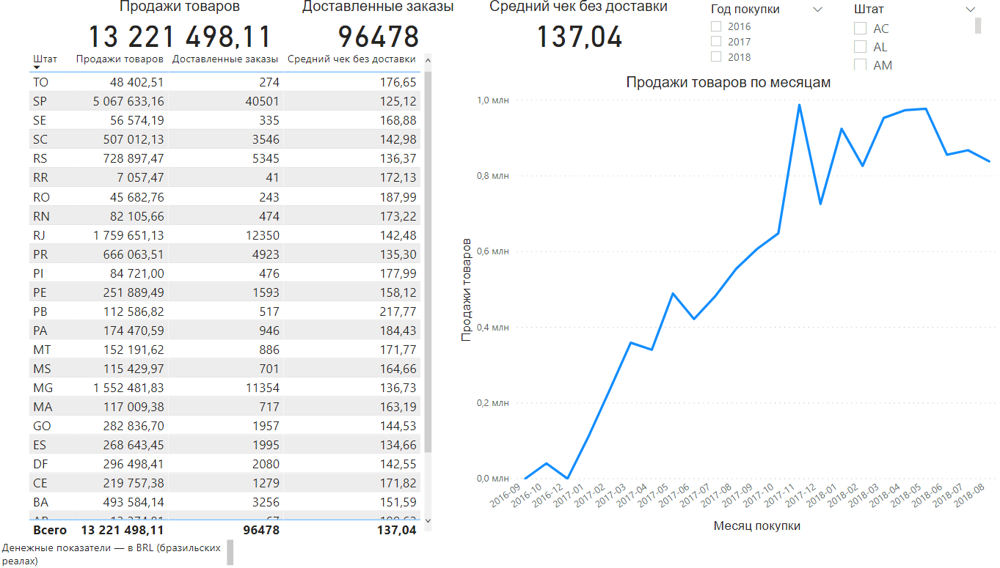
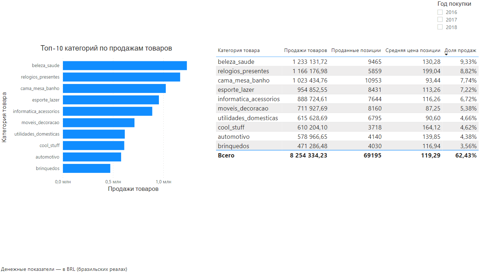
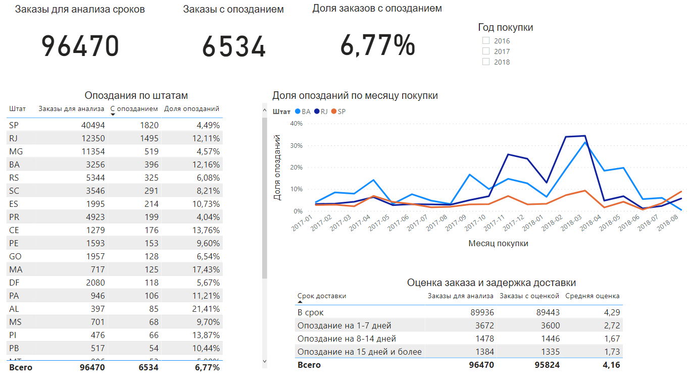

# Анализ продаж и доставки Olist

## Цель проекта

На основании статистических данных провести анализ объема продаж и их динамики, выделив основные категории товаров, выявить самые проблемные штаты и определить взаимосвязь между сроками доставки заказов и их оценкой.

## Данные и инструменты

Источник: [Brazilian E-Commerce Public Dataset by Olist](https://www.kaggle.com/datasets/olistbr/brazilian-ecommerce). Это опубликованные Olist обезличенные данные о заказах за 2016-2018 годы.

Использованные таблицы: 

- customers - содержит информацию о покупателях. Одна строка - запись о покупателе для конкретного заказа, идентифицируемая через customer_id;
- orders - содержит информацию о заказах. Одна строка - один заказ с определённым order_id;
- order_items - содержит информацию о товарах в заказе. Одна строка - одна товарная позиция внутри заказа, её определяет пара order_id и order_item_id; 
- products - информация о товарах. Одна строка - один товар каталога с определённым product_id;
- order_reviews - содержит информацию об оценках заказов. Одна строка - одна запись отзыва о заказе, у одного заказа может быть несколько таких записей.

Инструменты:

- PostgreSQL и SQL - хранение данных, создание таблиц, проверки качества, аналитические запросы и подготовка представлений для Power BI;
- Power Query - подключение к представлениям и подготовка импортируемых данных;
- DAX - меры и вычисляемые столбцы;
- Power BI - модель связей, визуализации и интерактивный отчет.

## Методика расчетов

Все денежные показатели приведены в бразильских реалах (BRL).

1. Продажи и средний чек. В расчет включены только доставленные заказы. Продажи — сумма price по всем товарным позициям доставленных заказов. Один product_id может повторяться: учитываем каждую проданную позицию.
Средний чек = сумма продаж / количество доставленных заказов. У нас: 13 221 498,11 / 96 478 ≈ 137,04. Деление на количество товарных позиций даст среднюю цену позиции. Стоимость доставки не учитываем.
2. Период анализа. За анализируемый период берем каждый месяц с 2016 по 2018 гг., при этом последний год представлен не всеми месяцами. Месяц и год определяются по дате покупки - purchase_date.
3. Опоздания. Для анализа используем только доставленные заказы с заполненными фактической и обещанной датами доставки. Опоздавшим считаем заказ, если фактическая дата доставки превышает планируемую. Затем делим заказы на группы по длительности задержки в календарных днях: "в срок", "опоздание на 1-7 дней", "опоздание на 8-14 дней" и "опоздание на 15 дней и более". 
Доля опозданий - число опоздавших заказов, деленное на число доставленных заказов с обеими датами. Для представления в процентах умножаем на 100.
4. Отзывы. Сперва рассчитываем среднюю оценку заказа, т.к. у заказа может быть несколько отзывов, а затем - в группе по длительности задержки. Заказы без оценки не входят в расчет средней оценки, но остаются в общем количестве заказов группы.

## Ограничения анализа

- Неполный 2018 год. Нельзя напрямую сравнивать годовые суммы за периоды разной продолжительности. Сравнивать одинаковые месяцы двух лет можно.
- Отбор доставленных заказов. Анализ проводится только в отношении доставленных заказов. Не подлежат рассмотрению заказы в других статусах (например, отмененные).
- Связь задержек и оценок. Мы наблюдаем более низкие оценки при длительных задержках, однако не учитываем влияние других факторов на оценку.

## Основные выводы

### Доставка и отзывы

1. Масштаб проблемы. С опозданием было доставлено 6 534 из 96 470 доставленных заказов с заполненными датами, доля которых составила 6,77%.  
2. Приоритеты по штатам. На SP и RJ приходится 50,73% всех опозданий, поэтому предлагаю их проверить в первую очередь. Если цель — улучшить доставку там, где чаще нарушают обещанный срок, то следует обратить внимание на штаты с самой большой долей опозданий - AL (21,41%), MA(17,43%) и SE (15,22%).  
3. Оценки и задержка доставки. Оценки сильно отличаются между тремя группами: "в срок", "опоздание на 1-7 дней" и "опоздание на 8-14 дней". При задержке 8–14 дней оценка — 1,67, при 15+ днях — 1,73. Обе группы остаются на низком уровне.   На основании этого я бы предложил выявлять риск опоздания до обещанного срока, а уже просроченные заказы отслеживать, чтобы задержка не затягивалась свыше недели. Заказы с более длительными задержками тоже требуют внимания.

### Продажи

Масштаб продаж за весь период:
- сумма продаж товаров - 13 221 498,11;
- количество доставленных заказов - 96 478;
- средний чек - 137,04.
Стоимость доставки в сумму продаж и средний чек не включена.

Ноябрь 2017 — месяц с максимальной суммой продаж за 2017 год. Рост по сравнению с октябрем обеспечило увеличение числа заказов несмотря на снижение средней стоимости заказа. Сумма продаж в ноябре выросла на 52,37%, количество доставленных заказов увеличилось на 62,77%, при этом средний чек упал на 6,39%. 

### Категории товаров 

Лидером по сумме продаж за анализируемый период является категория beleza_saude - 1 233 131,72.
На втором месте располагаются товары категории relogios_presentes - 1 166 176,98. Товаров первой категории было продано намного больше (9 465 по сравнению с 5 859), но при этом средняя цена товаров второй категории значительно выше (199,04 по сравнению с 130,28).
В 2017 году лидером по сумме продаж была категория cama_mesa_banho (490 596,92), доля продаж десяти крупнейших категорий - 63,12% а в 2018 - beleza_saude - 755 724,50 и 63,51% соответственно. 
Стоит отметить, что 2018 год представлен не всеми месяцами. 

## Скриншоты отчета

### Обзор продаж

### Категории товаров

### Доставка и отзывы

## Файлы проекта

- 01_create_tables.sql - создание исходных таблиц;
- 02_data_checks.sql - проверки пропусков, повторов и корректности данных;
- 03_sales_analysis.sql - анализ продаж, динамики и категорий товаров;
- 04_customer_analysis.sql - анализ покупателей и повторных покупок;
- 05_delivery_analysis.sql - анализ опозданий и связи сроков доставки с оценками;
- 06_powerbi_views.sql - подготовка представлений для Power BI;
- Olis_Analysis.pbix - модель данных, меры DAX и три страницы отчета: "Обзор продаж", "Категории товаров" и "Доставка и отзывы". 

## Как повторить анализ

1. Скачать исходные CSV и создать базу в PostgreSQL.
2. Выполнить 01_create_tables.sql, затем импортировать данные в пять таблиц.
3. Выполнить проверки из 02_data_checks.sql.
4. Выполнить аналитические запросы из файлов 03–05.
5. Создать представления с помощью 06_powerbi_views.sql.
6. Открыть файл Power BI, настроить подключение к своей базе и обновить данные.
